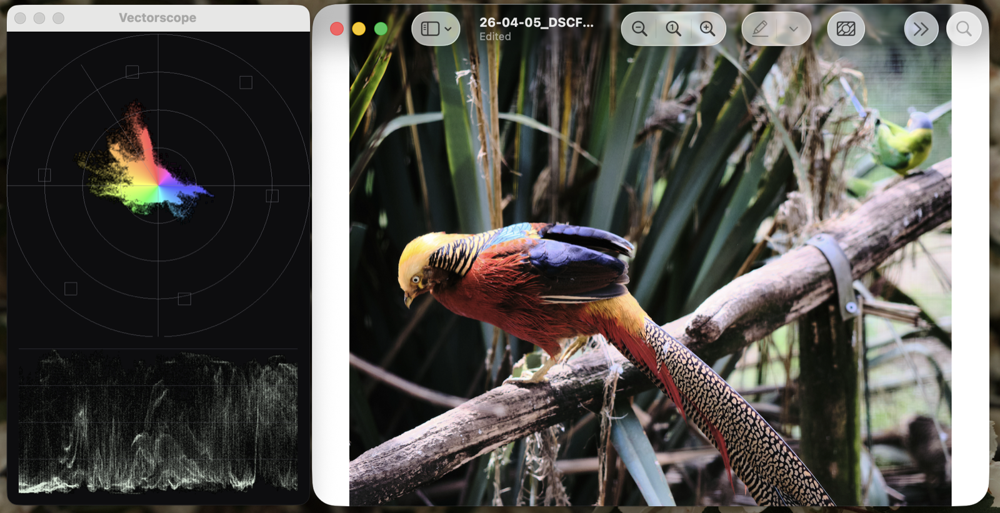

# Vectorscope

A lightweight, real-time colour vectorscope and waveform monitor for macOS. Pick
any region of your screen — a photo, a video, a grading window — and watch its
chroma and luma live.



## Install

Download the latest `Vectorscope-*-universal.zip` from
[**Releases**](https://github.com/toftul/scopes/releases/latest), unzip it, and
drag **Vectorscope.app** to `/Applications`. Then run:

```bash
xattr -dr com.apple.quarantine /Applications/Vectorscope.app
```

That step is required because the app isn't notarised (which needs a paid Apple
Developer account) — without it macOS refuses to open the download. Do it
*before* opening the app for the first time.

On first launch you'll be asked for **Screen Recording** permission. Grant it,
then quit and reopen the app.

Universal build (Apple Silicon + Intel), macOS 14 or later.

## Controls

Everything is in the **Scope** menu, or:

| Action | Shortcut |
|---|---|
| Pick region to scope | ⌘R |
| Scope whole display | ⌘D |
| Toggle Rec.709 / Rec.601 | ⌘C |
| Cycle vectorscope: colorize / mono / heatmap | ⌘M |
| Cycle waveform: luma / parade / RGB overlay | ⌘W |
| Brighter / dimmer trace | ⌘= / ⌘- |
| More saturated / more pale | ⌘] / ⌘[ |

## What it does

Whole-display or region capture, with the scope's own windows excluded so the
trace can't feed back into itself. The vectorscope draws a full graticule —
rings, crosshair, 75% target boxes and the skin-tone line — in colorize, mono or
heatmap. Below it sits a luma waveform, RGB parade or RGB overlay. Rec.709 and
Rec.601, with adjustable gain and saturation.

Capture and analysis run on the GPU every frame, so it stays smooth and cheap on
battery.

### Roadmap

- [ ] Region resize handles / live re-pick
- [ ] "Follow this window" capture mode
- [ ] RGB-tinted vectorscope trace (colour points by their source pixel)
- [ ] Menu-bar presence + preferences
- [ ] Notarised releases, so no `xattr` step

## Building from source

Needs only the Command Line Tools — no Xcode, no dependencies:

```bash
./build-app.sh && open build/Vectorscope.app
```

See [docs/DEVELOPMENT.md](docs/DEVELOPMENT.md) for the architecture, Metal
details and release process.

## License

[MIT](LICENSE) © 2026 Ivan Toftul
